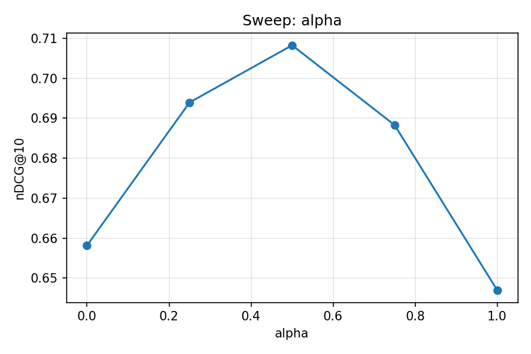

# Hybrid RAG Benchmark

A reproducible benchmark of **BM25 vs. dense vs. hybrid retrieval** on three
[BEIR](https://github.com/beir-cellar/beir) datasets, plus a fully local
retrieval-augmented generation pipeline that answers questions with inline
citations.

Everything runs offline on CPU after the initial dataset download: vectors are
computed locally with `sentence-transformers`, stored in **Weaviate**
(bring-your-own-vectors mode), and generation happens through **Ollama**, with no API
keys and no hosted inference.

```
BEIR corpus ──chunk (512 tok, 10% overlap)──► MiniLM-L6-v2 embeddings
                                                      │
                                                      ▼
   query ──►  Weaviate  ──► BM25  ┐
                         ──► dense ├──► top-k chunks ──► dedupe to docs ──► Llama 3.2 3B
                         ──► hybrid┘                                            │
                                                                                ▼
                                                           answer with [doc_id#chunk] citations
```

## Results

Full test split of each dataset, k=10, chunk size 512, hybrid α=0.5.
Metrics are document-level (chunks are deduped to their best-scoring document
before scoring against BEIR qrels).

| Dataset  | Queries | Retriever | Recall@10 | MRR@10 | nDCG@10 |
|----------|--------:|-----------|----------:|-------:|--------:|
| NFCorpus |     323 | BM25      |    0.1527 | 0.5216 |  0.3097 |
| NFCorpus |     323 | Dense     |    0.1546 | 0.5057 |  0.3146 |
| NFCorpus |     323 | **Hybrid**|**0.1700** |**0.5547**|**0.3442**|
| SciFact  |     300 | BM25      |    0.7878 | 0.6235 |  0.6582 |
| SciFact  |     300 | Dense     |    0.7860 | 0.6069 |  0.6470 |
| SciFact  |     300 | **Hybrid**|**0.8260** |**0.6752**|**0.7082**|
| FiQA     |     648 | BM25      |    0.2774 | 0.2687 |  0.2177 |
| FiQA     |     648 | **Dense** |    0.4458 |**0.4435**|**0.3697**|
| FiQA     |     648 | Hybrid    |**0.4475** | 0.4330 |  0.3650 |

Raw output: [`results/retriever_comparison.csv`](results/retriever_comparison.csv)
(and the pivoted view next to it).

### What the numbers say

- **Hybrid is the best default, but not unconditionally.** It wins every metric
  on NFCorpus (+11% nDCG over BM25) and SciFact (+7.6% nDCG), because both
  benefit from exact term matching *and* semantic similarity. On FiQA, whose
  informal financial questions rarely share vocabulary with their answers,
  dense retrieval alone is far stronger than BM25 (0.370 vs. 0.218 nDCG), and
  mixing the weak lexical signal back in at α=0.5 slightly *degrades* ranking
  quality (0.365 nDCG) even though it nudges recall up.
- **The α sweep confirms it on SciFact**: nDCG@10 peaks at α=0.5 (0.708) against
  0.658 for pure BM25 (α=0, +7.6%) and 0.647 for pure dense (α=1, +9.5%). The
  curve is smooth and single-peaked, so α is worth tuning per corpus but not
  fragile.
- **Chunk size barely matters here.** 256/512/1024 tokens all land within
  0.0005 nDCG on SciFact. That is a property of the corpus, not of chunking:
  SciFact documents are abstracts that mostly fit in a single chunk. The knob
  would matter on long-form corpora.
- **k behaves as expected**: recall@k climbs 0.724 → 0.826 from k=3 to k=10
  while nDCG moves much less (0.670 → 0.708), i.e. the extra documents are
  found but ranked low.
- **Cost of each retriever** (mean latency per query, CPU): BM25 ≈ 1.8–5.7 ms,
  dense ≈ 9–11 ms, hybrid ≈ 9–13 ms. Hybrid's quality is close to free once you
  are already paying for the embedding.

| Sweep | Values | Best |
|---|---|---|
| `alpha`      | 0.0, 0.25, 0.5, 0.75, 1.0 | **0.5** (nDCG 0.7082) |
| `chunk_size` | 256, 512, 1024            | flat (0.7086 / 0.7082 / 0.7087) |
| `k`          | 3, 5, 10                  | 10 (recall 0.826) |



Plots for the other two sweeps: [`results/sweep_k.png`](results/sweep_k.png),
[`results/sweep_chunk_size.png`](results/sweep_chunk_size.png).

### Generation

`scripts/rag_eval.py` takes the top-10 retrieved chunks, builds a
citation-constrained prompt, and asks a local Llama 3.2 3B for an answer. The
system prompt forces every claim to carry a `[doc_id#chunk_idx]` tag and forbids
answering outside the supplied context. Ten fixed SciFact queries (deterministic
by sorted query id, so runs stay comparable) are saved with their retrieved
passages, the exact prompt, and the answer in
[`results/rag_answers.json`](results/rag_answers.json), enough to audit whether
a citation actually supports the sentence in front of it.

## Quickstart

Requirements: Python 3.10+, Docker, ~8 GB free disk, and
[Ollama](https://ollama.com) for the generation steps.

```bash
python -m venv .venv && source .venv/bin/activate
pip install -r requirements.txt

docker compose up -d weaviate
curl -s http://localhost:8080/v1/.well-known/ready && echo "weaviate ready"

ollama pull llama3.2:3b        # ~2.0 GB; gemma2:2b works on 8 GB RAM machines
```

Then run the stages in order (each is a module, from the repo root):

```bash
python -m scripts.index_corpus                                  # download, chunk, embed, index
python -m scripts.compare_retrievers                            # the table above
python -m scripts.rag_eval --dataset scifact --retriever hybrid # RAG answers with citations
python -m scripts.sweep --dataset scifact                       # hyperparameter sweep + plots
python -m scripts.demo                                          # one query through all 3 retrievers
```

Useful flags:

```bash
python -m scripts.index_corpus --recreate --chunk-size 256   # rebuild collections
python -m scripts.compare_retrievers --datasets scifact      # subset of datasets
python -m scripts.rag_eval --dataset fiqa --retriever bm25 --qids 5 12
python -m scripts.sweep --skip chunk_size                    # skip the re-indexing sweep
python -m scripts.sweep --rag-qualitative                    # regenerate answers per sweep value (slow)
```

## How it works

- **Chunking** (`src/chunking.py`): fixed token windows from the embedding
  model's own tokenizer, 10% overlap, title prepended to the body.
- **Indexing** (`src/indexing.py`): one Weaviate collection per
  (dataset, chunk size), e.g. `Scifact_c512`. Weaviate runs with
  `DEFAULT_VECTORIZER_MODULE=none`: embeddings are computed here and passed in,
  which keeps the whole pipeline offline and makes the embedding model a
  swappable detail.
- **Retrieval** (`src/retrieval.py`): BM25, dense (cosine over L2-normalized
  vectors), and Weaviate's hybrid fusion. BEIR qrels are document-level while
  the index is chunk-level, so each retriever asks for `k * 8` chunks, keeps the
  best-scoring chunk per `doc_id`, and truncates to top-k documents. That best
  chunk is also what gets handed to the LLM.
- **Metrics** (`src/metrics.py`): Recall@k, MRR@k and graded nDCG@k, computed
  from scratch so the scoring is auditable rather than hidden in a library.
- **Generation** (`src/rag.py`): Ollama chat with a citation-enforcing system
  prompt, temperature 0.2.

```
src/                     scripts/                    results/
├── config.py            ├── index_corpus.py         ├── retriever_comparison.csv
├── data_loader.py       ├── compare_retrievers.py   ├── sweep_results.csv
├── chunking.py          ├── rag_eval.py             ├── sweep_*.png
├── indexing.py          ├── sweep.py                ├── rag_answers.json
├── retrieval.py         └── demo.py                 └── sweep_rag_answers.json
├── metrics.py
└── rag.py
```

## Notes and limits

- Results were produced on CPU with `all-MiniLM-L6-v2` (384-dim), a deliberately
  small embedding model; absolute numbers would rise with a larger encoder, but
  the BM25/dense/hybrid ordering is the point here.
- The first indexing run downloads ~2 GB of BEIR data and embeds every chunk
  (FiQA is ~57K documents), which takes a few minutes on CPU. Later runs reuse
  the collections unless `--recreate` is passed.
- `torch` is not imported directly anywhere in the code; it is the backend
  `sentence-transformers` and `transformers` run on, and is pinned in
  `requirements.txt` for that reason. CUDA is picked up automatically if
  present, but nothing here requires a GPU.
- If `pip install` cannot find a `torch` wheel, use Python 3.11/3.12, since wheel
  availability for the newest Python minor tends to lag.

## License

GPL-3.0. See [LICENSE](LICENSE).
